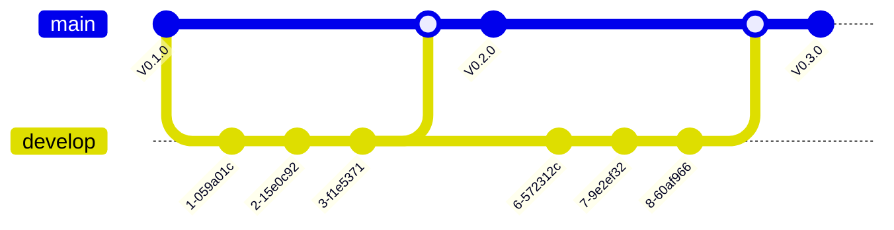
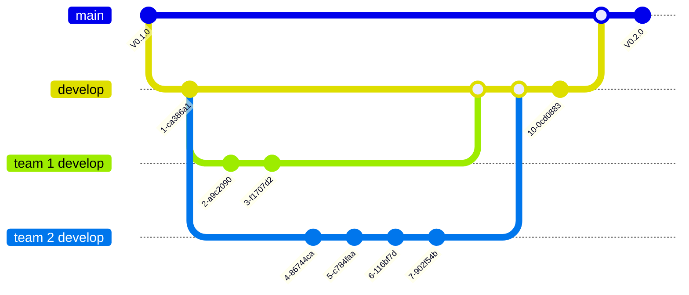
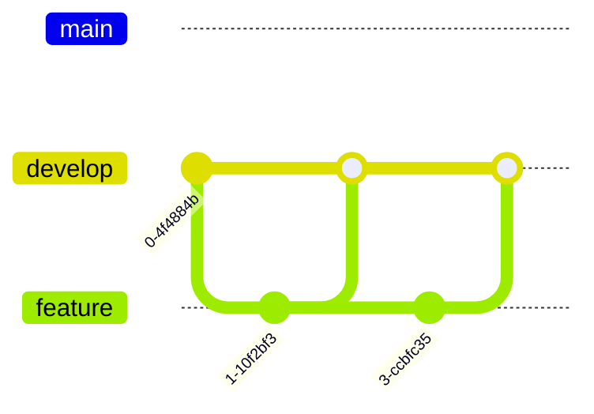
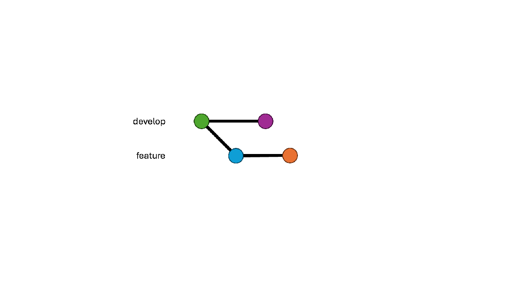
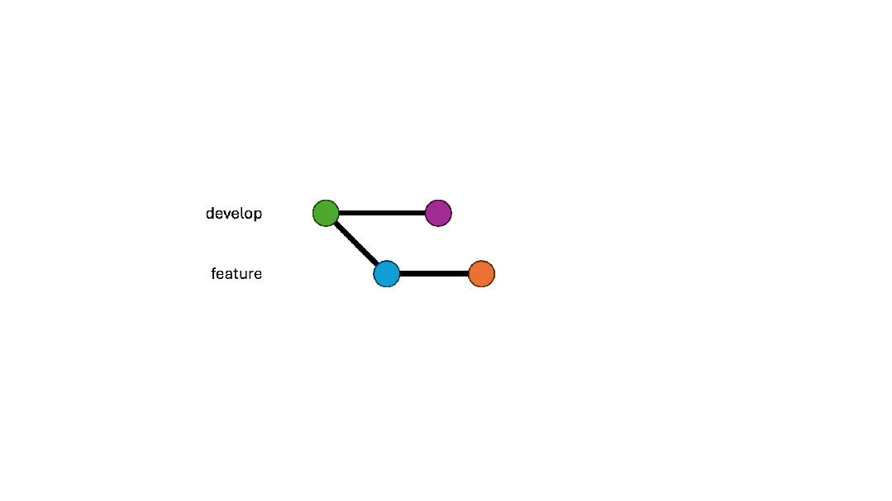
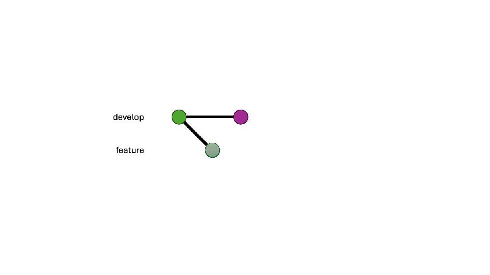
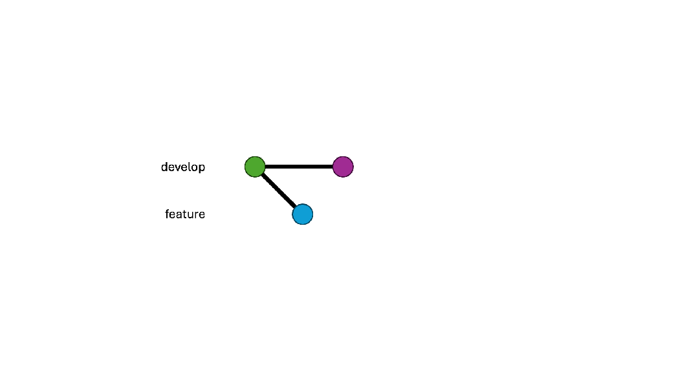
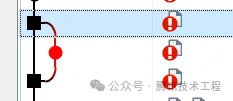

[TOC]

> Git是个超级强大也非常流行的版本控制系统（VCS）。它的设计理念和其他VCS非常不同。纵观整个业界，很多人在用旧的思维方式来解决git的使用问题，
有svn方式的、p4方式的、奇怪方式的、错误方式的，等等，而不是更新成git的思维方式。虽然git非常灵活，确实可以用这些方式来使用，但其实操作起来反而更难，
而且效率更低，吃力不讨好。这里我打算把二十多年的各种版本控制系统的使用经验和十多年git的使用经验，总结出一些git的最佳实践。其实很多时候，
正确的做法比错误的更简单，更不容易出错。

# 什么是Git

Git是一个分布式版本控制系统，跟踪目录里的修改。它的工作流是非线性的（不同电脑上的平行分支形成了一个graph）。和主从式的系统不一样的是，每台电脑上的每个git目录都是一个完整的repo，包含全部历史和完整的版本跟踪能力。（LFS是个例外，后面会提到。）

因为git的本质是一个基于目录的分布式VCS，这里面并没有中心服务器的角色。去中心化是未来。同个项目的所有repo都是平等的端点。一个repo可以在服务器、本地目录、其他人的电脑上。只是为了团队协作的目的，会认为指定一个或多个端点作为”服务器“。是的，可以同时有多个上游服务器。很多时候这么做很有必要。比如对内开发的repo和对外开源的repo，就是两个不同的端点。可以有不同的分支和推送频率。本地只要一个repo就都管理了。

非线性的工作流表示提交和分支操控是一个常规的操作。建立分支、rebase、修订commit、强制推送、cherry-pick、分支复位，在git都是很正常的使用方式。

# 什么不是Git

很多东西经常和git一起出现，但是并不是git的一部分。

**Github/Gitlab**

这些都不是git，而是提供git服务和社区的网站。Git是个基于目录的VCS，并不需要网站服务或者网络访问才能工作。早期经常有人没法区分github和git。当要说git的时候，会说github，制造的混乱不是一星半点。

**Fork**

Fork仍然也是git服务网站的功能，用来简化协作流程。在没有fork的时候，如果你想往开源项目里修bug或者加feature，会需要这样的流程：

1. 克隆repo
2. 修改代码
3. 生成补丁
4. 发到论坛或者支持的邮件列表
5. 找作者来review，合并补丁

很多项目到现在还是这么做的。如果有了fork，可以简化成：

1. Fork并克隆repo
2. 修改代码
3. 发出merge request或者pull request

虽然fork很有用，但这仍然不是git的一部分。它用到的是git的分布式能力。本质上，在fork的时候，它会克隆一份repo，把原来的repo设置成上游。所以其实如果你的目标不是为了继续把repo放在网络服务上，那就克隆到本地就是了。太多的人把fork当作like来用，根本就是错的。如果没打算改代码，fork是没意义的。机器学习界这个问题尤其严重。经常放一个README就假开源了，还有几百个fork，都不知道能fork到什么。

**Merge request/Pull request**

Github上叫Pull Request，gitlab上叫merge request，其实是一个东西的不同视角。这些都是code review和合并的流程，不是git的一部分。

需要注意的是，它们的重点在“request”，而不是merge或者pull。如果你要把一个分支merge到你自己的，没必要开一个MR然后自己给自己通过。在本地merge就是了，更简单更快。

**Import**

很多git服务支持“Import”，用来从别的git、svn、cvs、p4等VCS导入一个库。如果原本的repo已经是git，那直接push到新的地方就是了，比import更简单。而且这样绝对不会丢失历史记录或者搞错文件。如果是其他VCS的repo，那也可以用插件或脚本来先转成一个本地的git repo，然后再push到新的地方。

# 选对工具

Git本身是个命令行工具。但是，非线性工作流的本质就让它没可能在字符界面显示出分支的graph。选个好的GUI非常关键。不但可以大幅度增加工作效率，更重要的是，减少出错的机会。第二个常见的git使用错误来源，正是因为用错了工具造成了。

Windows上最好的git GUI是TortoiseGit，没有之一。它只是个GUI，git命令行需要事先安装。和其他Tortoise打头的工具（TortoiseCVS、TortoiseSVN）一样，它的风格是没有主UI，而集成到Windows的文件管理器里面。Repo里的文件（也就是目录里的）图标上会覆盖上状态。右键点击这个目录，菜单里可以看到TortoiseGit的子菜单，包含git的一些操作。大部分VCS的GUI工具，比如P4V、SourceTree，UGit，都有个主UI显示映射了的工作空间，而不是目录本身。对于git来说，这其实是个错误，因为git是基于目录的，不存在工作空间这个概念。而且，这种情况下非常常见的错误就是忘记提交新增的文件。在TortoiseGit里，除了盖在图标上的状态之外，提交窗口也可以显示出哪些文件还没添加，不会出现遗漏的情况。

另外，TortoiseGit有一个独特的版本graph查看器，里面可以显示出repo的整个分支结构。通过这个查看器，可以很方便地看出来repo是怎么成长的，有那些不必要的分支，如何从一个分支跳到另一个，等等。这是TortoiseGit比其他git UI好的一个重要原因。不管是Visual Studio里的、SourceTree、还是UGit，在UI设计上都像用传统的VCS思路来套用到git上，而不是git的思路。主它们的共同问题就是，基本只关注于当前分支。而有能力同时看所有分支，对git来说非常重要，因为git的工作流是非线性的。

其他高级功能，比如打补丁、处理submodule（非常重要)，都可以在TortoiseGit的GUI里完成。但它没法覆盖所有的功能。有些很少用的，还是得通过命令行。

# 尽量在本地

所有的git操作都可以在本地repo上完成，因为服务端的并没有更高优先级。虽然大部分提供git服务的网站都在网页界面里有cherry-pick、新建分支、合并这些操作，但是在本地执行更容易，而且比在服务端执行了再拉下来要更快。

# 分支策略

Git的工作流是基于分支的。不但每个repo是平等的，每个分支也是。Master/main、develop这些只是为了简化管理而人工指定的有特殊含义的分支。这里的分支策略是为了更好地协作而产生的习惯规范，不是git的工作流本身必须定义的。分支可以分为几个层次。

## Main分支

这是整个项目的稳定分支，里面的内容可能相对较老，但是这个分支里的内容都是经过测试和验证的。原先都叫master，因为政治正确的要求，最近越来越多新项目开始用main。有些快速开发的项目甚至不采用main分支。

## Develop分支

开发主要发生在develop分支。新特性先放到这个分支，再去优化和增强稳定性。



## 大项目可选的团队develop分支

对于跨团队的大项目，每个团队都有自己的兴趣点和发布周期。很常见的做法是，每个团队有自己的develop分支。每过一段时间合并到总的develop分支。一般来说，中等大小的团队，专注于repo的某一部分，可以采取这样的分支形式。小团队或者个人没有必要有自己的develop分支。那样反而会浪费时间和增加合并过程中的风险。




## Feature分支

Feature分支是生命期很短的分支，专注于单个特性的开发。和其他VCS不一样的是，在git里开分支开销非常低，所以可以高频地开分支和合并分支。在做一个特性的时候，常规的流程是这样的：

1. 从develop分支上新建一个feature分支
2. 提交一些关于这个feature的代码
3. 合并回去
4. 删除这个feature分支

对于本地repo里的feature分支，你可以做任何事。常见的用法是在开发过程中非常频繁地提交，走一小步就提交一次。在发出MR之前，先合并成一个commit，把这个分支变整洁，方便后续操作。

当feature分支合并之后，绝对不存在任何理由让这个分支仍然存在于服务器上。WOA现在有自动删除的选项，可以设置成默认开启。但有时候仍然会出些问题，这个选项会消失，需要手工删除分支（其实就是在MR页面上点一下的事）。记住：服务器上只是一个端点，删掉那边的一个分支不会影响你的本地repo。如果你有后续工作需要在那个分支上做，就继续在你本地的分支上完成就是了。这和服务端有没有这个分支一点关系都没有。




因为每个分支都是平等的，可以推出在任何一个分支上都可以新建分支。比如，如果特性B依赖于特性A，你不用等特性A合并了才开始做特性B。只要在特性A的分支上建立一个特性B的分支就可以了，即便特性A不是你的分支也可以。等到特性A合并了，把特性B的分支rebase一下就是了。少了等待环节，效率提高很多，也不必催人做code review。

能建立大量feature分支，对于提高工作效率非常关键。每个特性建立一个feature分支，在上面完成特性，发出MR。在code review通过之前，已经可以新建另一个特性专用的feature分支，切换过去，开始做另一个特性。在code review过程中还能来回切换，同时做多个特性。其他VCS是做不到这一点的，效率也自然低很多。

## Release分支群

Release不只是一个分支，而是一群以“release/”打头的分支。就好像一个目录，包含了不同版本给不同产品线的release分支。一般来说他们从main或者develop分支出来。当发现一个bug的时候，在main或者develop分支修好，然后cherry-pick到release分支里。这种单向的处理可以方便管理，并且不用担心某个commit是不是只有release分支有。Release分支经常在每个sprint的开头创建，包含这个sprint要发布的东西；或者在每个sprint的结尾创建，包含下一个sprint要发布的东西。

# Merge还是rebase

虽然在提及把commit从feature分支放到develop分支的时候，我们一直说”合并“，但其实这里存在两个维度。是的，不是有两个操作，是有两个维度。

第一个维度，是merge还是rebase。这是两种”合并“的方式。第一种是普通的合并，和传统的VCS一样。它会把一个分支合并到目标分支，在顶上建立一个commit用来合并，两个分支里已有的commit不会有变化。



另一个就是rebase。它会从分支分出来的地方切开，嫁接到目标分支的顶端上。（我一直认为rebase应该翻译成嫁接，而不是“变基”。）


第二个维度是是否squash，也就是选择一个分支里的一些commit，压扁成一个commit。这个任何时间都能做，即便不是为了合并也行。在TortoiseGit里，这叫“combine into one commit”。



两个维度组合之后，我们就得到了4个操作。但是“squash再merge”没有任何意义，所以就剩下”不squash就merge“, ”不squash就rebase“，以及”squash再rebase“。（微软的devops文档曾经有个严重的错误。里面描述成merge表示不squash就merge、rebase表示squash在rebase，而没有把它们当作两个维度来看。是我在2018年左右提出了这个问题，并且要求他们修改，还提供了多个图片解释它们到底有什么区别。过了大概半年之后才改成对的。但很多人就是从那里学的git，都被带坏了。）

其实还可以有第三个维度，修订与否。但这个更多的是发生在merge之前的过程。修订，amend，表示当提交的时候，是不是要覆盖掉上一个commit。打开的话，提交之后还会只有一个commit，而不是两个。






现在的问题就是，什么时候用什么。要是要处理的是长生命周期的分支，比如团队的develop分支、develop分支、main分支，合乎逻辑的选择是merge。因为它们的结构需要保留，而且合并后分支也不打算消失。

对于feature分支，不同团队可以有不同选择。这里我只说最高效，开销最低的。一个feature分支里可以有多个commits，但它们只有合在一起的时候才会成为一个feature。中间的commit以后就再也用不到了。留着只会浪费空间和时间。所以逻辑上，这些commit就需要被squash。这时候如果merge一个只包含一个commit的分支，就会出现这样的graph：



这里有个什么都不做的commit，只是把两个分支抓在一起，以及一个永远挂在外面的commit。即便git里开分支和合并的开销很低，但这会一直积累的。这里用merge，就完全是在浪费时间和空间。对于feature到develop的合并来说，rebase是最佳选择。

现在，如果早晚需要把多个commit合成一个，那就该用amend。是的，大部分时候，一路amend过去，比最后才来squash更好。首先，rebase一个commit，会比rebase一串来得容易得多，特别是有代码冲突的时候。其次，如果MR的最后才squash & merge，那commit的消息就是没有经过review的，增加了犯错的风险。（是的，非常经常发生）

所有这些操作都可以在本地完成。这比在Web UI上操作远程的repo要容易而且高效。总结起来，这里的最佳实践是：

1. 在开发过程中可以用commit或者amend commit
2. 在发出MR的时候squash成一个commit
3. 在MR的迭代内持续用amend commit
4. 在MR通过后用rebase进行合并

（其实，p4里面的每一次submit，都是amend + rebase。之前只是因为没有人告诉你这个事实。而且p4里只有一种submit的方式，没有思考和选择的空间，做就是了。但这绝不代表不需要思考“有没有更好的做法”这个问题，这非常重要。）

更复杂的情况是在跨公司的repo上工作，比如UE。这时候规则需要做一些改变。一般来说，这种情况下你的feature分支是从release分支上建出来的，而不是develop分支。而且这种feature分支其实是作为develop分支来用，有长的生命周期。这时候，如果你要把一个特性从比如UE 5.1移植到5.2，rebase就不是最佳选择了。因为那样的话会把5.1 release分支里的所有commit和你的所有feature commit一起rebase。而你真正想要的是只把你的commit给cherry-pick过去。这其实还是因为工具。如果用的是TortoiseGit，就不会有这个疑惑。因为里面rebase默认是交互式的。你可以精确选择哪些commit需要操作。这就让rebase和cherry-pick变成一样的东西。唯一的区别，是rebase是让git选一个commit的列表，让你从中选哪个要哪个不要。而cherry-pick是让你直接选commit的列表。

# 处理合并冲突

当出现合并冲突的时候，最好的方式是先把你的feature分支rebase到目标分支的顶端，这时候解决冲突，然后force push。如果用WOA的冲突解决（可能有些别的基于web的git服务也有），它会每次都做merge。结果经常把简单的单个commit rebase，变成了复杂的三分支合并。

**常见错误：解决合并冲突后建了个新的MR**

因为冲突解决的错误行为，有可能在解决之后，修改被提交到了一个新的分支。这时候应该把你的分支reset到新的去，force push，再删掉新的；而不是关掉原先的MR，在新分支上开个新MR。

**常见错误：把分支搞乱**

如果真的遇到了多分支复杂交错的情况，有两个方法可以尝试清理出来。

1. 强制rebase。Fetch一下整个repo；把你的分支rebase到目标分支上的时候勾选force；这时候在列表里选要拿去rebase的commit。大部分时候这都能行。但有时候git因为分支太错综复杂而搞不清楚commit，在列表里会有遗漏。
2. Cherry-pick。在目标分支上新建一个临时分支；把有用的commit都cherry-pick过去；把你的分支reset到那个临时分支上；最后删掉那个临时分支。

> 两个方法最后都需要force push。


# 不要pull，要fetch

很多教程都说push和pull是在本地和远程repo之间同步的指令。但是其实push是基础指令，pull不是。它是fetch当前分支->和本地分支合并->reset到合并后的顶端。这里就产生了不必要的合并。你可以打开rebase pull，这就简化成fetch当前分支->rebase本地分支。

好一些，但是每次pull的时候都会开启rebase的窗口，即便没什么好rebase的。其实如果改用手动运行fetch和rebase，同样的工作量可以获得更多。因为默认的fetch可以拿到所有分支，而不是只有当前分支。然后你可以决定哪个分支rebase到哪里。整个过程中都可以保证没有错误的merge发生。


# 小而完整的commit

每个commit都该小而完整，有些人把这个叫做”原子性“。不要把多个特性压到一个commit里，同时不要有一堆必须合起来才能用的commit。

**常见错误：一个commit里做多件事情**

这是一个非常常见的错误。一个大的commit包含多个任务的代码。这样的commit必须要拆成多个才行。在git里，这样的拆分比较容易。如果一个分支“Feature”包含了特性A和特性B的代码，那么，

1. 在“Feature”的顶端建立“Feature A”和“Feature B”两个分支
2. 切换到“Feature A”分支，删掉其中特性B的代码，开amend提交
3. 把“Feature B”分支rebase到新的“Feature A”分支

这就行了。现在两个分支都分别只包含一个特性。如果特性B不依赖于特性A，它还可以继续rebase到develop分支去。


**常见错误：多个不完整的commit**

另一个非常常见的错误是不完整的commit，比如不能编译、不能运行、只包含琐碎的修改、或者仅仅为了未来的使用而做的修改。这样的commit只是中间结果，没法单独存在，需要和其他commit合起来才变成一个完整的commit。那它们就需要合并之后才发MR。


**拆分大的commit**

是的，有时候是需要把一个大的commit拆分成多个，让MR更容易看。但是这里的拆分并不能让commit变得不完整。如果一个大commit中的一部分，本身就能对现在的代码库有帮助，拿着就能提出来变成一个独立的commit。常见的是独立的bug修复、代码整理、或者重构。


# LFS技巧

LFS是git里蛮特殊的一部分。为了让git更好地支持大（二进制）文件，LFS其实让git的设计做了一些妥协。LFS比git晚了9年发布，而且花了好多年才让主流git服务都提供支持。

**LFS是怎么回事**
保存完整历史的大文件，特别是大的二进制文件超级占空间和处理时间。在LFS里，默认子保存一个版本的大文件，历史则放在另一个端点，一般是服务器。本地其实也可以这样拉取完整的历史：

```git lfs fetch --all```

当从一个git转移到另一个的时候，会要求做这件事情。其他时候一个版本就够了。

另外，LFS有加锁解锁的功能。但是和主从式的VCS不同的是，加锁解锁不会自动扩散到所有端点。这还是因为并不存在中心服务器的概念。

**常见错误：没开LFS**

非常重要的一件事情是，LFS不负责鉴别哪些文件是大文件。在添加大文件之前，它们路径需要加到.gitattributes里，可以用通配符。一旦路径在.gitattributes里了，文件操作就会自动通过LFS过滤，不需要额外的手工操作。

但是，如果一个文件在没有改.gitattributes之前就添加了，那它会被当作普通文件。要纠正这个，需要把文件路径放到.gitattributes，然后执行：

```git add --renormalize .```

才能把当前目录下的LFS状态修正过来。但历史里面的没法改，一旦提交了，大文件就会永远在那边。通过那样的方法过滤git库，删除不小心提交的大文件非常痛苦。过程中会有很多手工操作和确认，但至少这件事情是可做的。在实际项目中，我曾经把一个野蛮生长到1.6GB的git库，通过去掉没开LFS的情况下提交的第三方依赖和数据，精简到了10MB，而且所有历史记录都在。其他VCS甚至不会有机会这么做，只能无限增长下去，或者砍掉一段历史记录。

**滥用LFS**

另一个极端就是滥用LFS。把所有的文件都当做大文件来添加，这样git repo就表现成了个svn。当然，git相对svn的大部分优点也没了，开发效率下降5-10倍。要进一步把效率下降10倍，可以锁上所有的文件。这样所有人都需要checkout文件才能编辑。这样的git repo就退化成了一个p4库。（要再次把效率下降10倍，就在同个项目上混合使用git和p4。可以肯定，到不了10次commit，就会有人搞错，把文件同时放到两边，造成两边都混乱。）

**封装LFS锁**

刚提到，LFS锁所有的东西可以很容易把开发效率下降2个数量级。但是，对于非编程的工作流，比如美术工作，反正是没有diff的操作。这就会变成加锁->check out->修改->提交->解锁，和主从式VCS的工作流一样。一个常见的解决方法是写一个脚本来加锁、扩散锁的状态，另一个脚本来做提交、解锁、扩散锁的状态。把LFS锁封装之后，工作流既可以符合美术类，也同时保持编程类工作流的效率。从另一个角度想这个问题：git有机会封装成同时符合编程类和非编程类工作流，保证两边的效率；但是svn/p4却没可能封装成提高编程类工作流效率的。


# Git的缺点

当然，git不是完美的，有些地方仍然比其他VCS有些缺点。解决这些问题的办法，有，但支持并不广泛。

**缺乏分支权限管理**

Git没有内建权限管理（来自于Linus Torvalds的设计理念）。当一个人获得访问repo的权限，所有的分支都能访问到。有些服务通过控制“.git/refs/heads”下的文件访问，提供了基于分支的权限管理。这就能有基本的权限管理，又不需要修改git。

**巨型库（单一库）**

当Linus Torvalds设计git的时候，首要目标是支持Linux内核的开发，需求限于这样的中等规模。对于一个巨大的项目，git的性能并不好。想想在“git status”的时候，git需要穷举目录下的所有文件，比较当前的和repo里的区别。这肯定会花不少时间。

这几年，git也在这上面做了一些改进。Git 2.25里引入的部分clone和稀疏checkout可以让你不需要把整个repo都clone或者checkout，只要你需要的一部分子目录就行。但这些还比较新，不是所有服务提供方都支持。

要解决存放Android源代码的需求，Google有个工具叫“repo”。它可以管理多个git repo，就好像一个巨大的repo一样。这个工具支持Linux和macOS，但是Windows上基本没法用。同时，因为本质上其实还是一堆git库的集合，把文件从一个git挪到另一个，就会丢失历史。Google的另一个工作是Git protocol v2。它可以加速repo之间传输的速度。

微软的Windows长期以来一直用的fork的p4，叫做source depot（SD），作为版本控制。在2015年的某个时候，p4已经无法满足现代的敏捷开发和协作的需求，于是考虑切换到git。即便代价非常大（切换了一个用了20年以上的系统，大量修改bug跟踪、自动编译、测试、部署系统，培训部门里的每个人，配发大容量SSD。），也要坚持去做，因为都知道这才是未来。直接转的话，单个git库的大小是270GB，clone一次得花12小时，checkout花3小时，甚至连“git status”都要10分钟，简直没法用。于是有人开始考虑通过引入一些主从的特性来改进git。但因为他们对开源社区的无知，甚至连搜索一下都不，就给这个东西起名叫gvfs（git virtual files ystem)，全然不顾已经有叫这个名字的知名项目GNOME virtual file system。被诟病了几年才改名叫VFSForGit。它不是git的直接替代。首先是引入了一个新的协议，用于虚拟化repo里的文件。

在克隆的时候，不用git clone，而用gvfs clone。在.git和工作目录下的所有文件都只是个符号链接，指向服务器上的真实文件（有了中心服务器的概念），在本地硬盘上不占空间。然后有个后台驻留程序在监视这个虚拟化。读文件的时候，它就把文件内容从服务器取到本地的cache，修改文件的时候，它就把符号链接替换成硬盘上的普通文件（相当于自动checkout）。同时这个驻留程序还监控文件读写的操作。如果文件没有被写过，就认为内容不变。这样就只需要比较被写过的文件，而不是目录下所有文件（相当于不按内容判断是否相同）。然而，这其实破坏了git的很多设计原则，以及放弃了按文件内容决定是否发生改变的规则。显而易见没可能被官方的git采纳。这些对规则的破坏，这也使得VFSForGit无法和很多git GUI很好地配合使用，包括TortoiseGit。

因此，微软换了个方向，新做了一个叫做Scalar的系统。这个就不用虚拟化了，也不会改变git的工作流。它是以扩展的形式，优化原有git的部分clone和稀疏checkout，不再修改git的基础。但它的适用性仍然是个问题。目前只有微软fork的git和Azure devops支持这个。实际上meta和google也一直在等待着git能更好地支持单一巨型库，并时不时尝试从自己开发的系统里切换过去。

但是随着时间的发展，总会有更多改进被合并到官方的git去。这个问题会慢慢改善。对绝大部分项目来说，这些问题并不会遇到，也不会是问题。

# 总结
像git这样灵活的系统，达到同个目的往往存在多条路径。这里提到的这些git最佳实践，希望能帮助朋友们找到路径中最优的一条。你越是了解git，越能明白逻辑正确的版本控制应该是什么样的，越会支持git的使用。而正好相反的是p4。你越是不了解p4，越会支持p4的使用，因为它并没有给人思考的余地，所以用再久也没法了解什么是版本控制。


抄袭：https://mp.weixin.qq.com/s/3P9lkbwJwORW42dZxuPAfg
